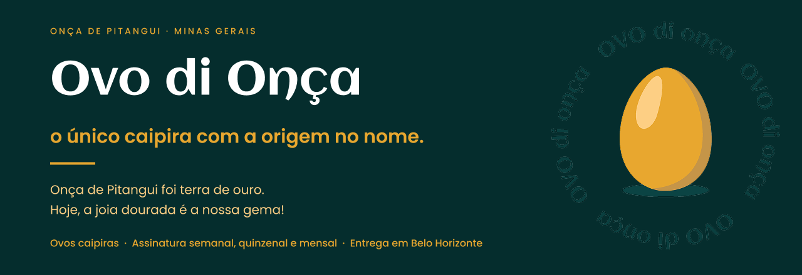

  

 

## Quem somos

A Ovo di Onça é um negócio de família nascido em Onça de Pitangui, em Minas Gerais — a antiga terra do ouro que dá nome à marca. Vendemos ovos caipiras por assinatura, com entrega em casa em bairros de Belo Horizonte.

Este perfil guarda o código do que a gente usa para atender o cliente: o site onde a pessoa escolhe o plano e o sistema interno que controla as entregas.

 

## Projetos

<table>
  <tr>
    <th align="left">Projeto</th>
    <th align="left">O que faz</th>
    <th align="left">Situação</th>
  </tr>
  <tr>
    <td><strong>Site de assinatura</strong></td>
    <td>Apresenta a história, os planos, os bairros atendidos e leva o pedido até o WhatsApp</td>
    <td></td>
  </tr>
  <tr>
    <td><strong>App de gestão</strong></td>
    <td>Controle interno das assinaturas: plano, bairro, dia de entrega e status do cliente</td>
    <td></td>
  </tr>
</table>

 

## Stack

Front-end em SPA, sem framework de estado: os dados de negócio (planos, bairros, FAQ) ficam centralizados em `src/data/` e chegam aos componentes por props.

 

## Contato

Assinatura, dúvida sobre bairro atendido ou dia de entrega: fale com a gente no WhatsApp.

 
 

---

  Ovo di Onça · Onça de Pitangui, MG

